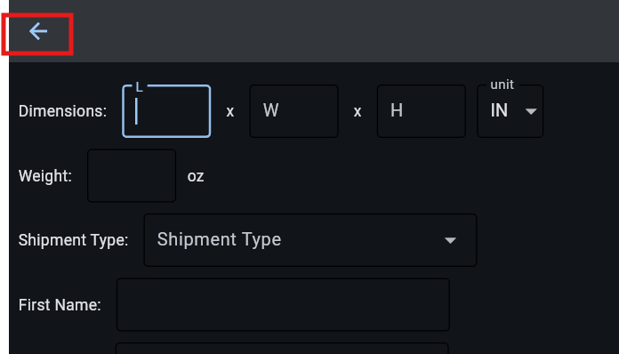

# Thank you for trying out this project!

## Overview
This instance features 4 interfaces for the user to interact with the system:
1. Tracking interface. This is made for the end user to view the status of their package. 
2. Clerk interface. This is made for the clerk to enter a package into the system.
3. Manager interface. This is made for the manager to view the packages in their facility and assign them to a driver.
4. Driver interface. This is made for the driver to view the packages they need to deliver, and mark them as delivered.

In order to use this system, you will need to use on of the accounts listed at the bottom of the page. None of these accounts require a password, since this is a demo.

If you would like a guided demo with photos, skip to [`Guided Demo`](#Guided-Demo)

---

## Getting Started

### Entering a Package
To begin, log into a clerk account to enter a package into the system. For this demo, use the "clerk1" account, assigned to the "Chicago Distribution Center", or any of other clerks listed in [`Accounts`](#Accounts) While the address you enter does not need to be valid, you must complete all the fields on the main page. 

- The **Additional Options** button allows you to enter insurance information.
- Click **Estimate** to receive a shipping cost estimate.
- After generating the estimate, click **Submit** to add the package to the system.

You should copy the generated tracking number into a text editor to save it for future reference. 

Note: The delivery distance is fixed at 500 miles for this demo, so the estimates will remain the same. Ideally, the system would calculate the distance based on the actual addresses entered, but this feature is not implemented to simplify the demo and avoid requiring valid addresses. If implemented, the price and delivery time would be calculated based on the distance.

---

### Assigning a Package
Next, log into a manager account to assign the package to a driver. I would recomend using the "manager1" account, which is also assigned to the "Chicago Distribution Center" in this demo. The manager interface will display all unassigned packages within the facility. Your recently entered package should appear in the list.

- Click on the package to assign it to a driver and a destination. The destination can be either the final address or another facility.
- Take note of the driver's name, as that's the next account in the chain.

---

### Delivering a Package
Log into the driver account to complete the delivery. The driver interface will display all packages assigned to that driver, along with options to load them.

- Click on the package to 'load' it
- Navigate to the 'Delivery' view
- Select a package and mark it as delivered.
- If the package was delivered to the final address, the process is complete.
- If delivered to another facility, log into a manager account at that facility to assign the package to another driver at that facility until you deliver to the destination address.

---

### Tracking a Package
To track a package, simply enter its tracking number. You’ll be able to view the current status, a map showing the delivery location once the package is delivered, and the delivery history.

Note: The map will always display the same placeholder location because the delivery coordinates are based on a fixed entry in the system. Ideally, the system would record the actual geolocation when the package is delivered, but this feature is not implemented to simplify the demo.

---

## Small Things You May Have Missed
- The UI is reactive, and changes based on the size of the screen when it is loaded.
- The Clerk, Manager, and Tracking UIs are all designed to be quick and optimized for only keybaord input.
- The Driver UI is optimized for a phone screen, since that is what a driver would likley use when loading their truck and making deliverys.
- If you add /'trackingnumber' to the URL, you will automatically be directed to the tracking view for your package.
- It has auto dark and light modes.

## Accounts
Here's a list of accounts based on the facility they are assigned to:
- Chicago Distribution Center
  - Clerk: clerk1
  - Manager: manager1
  - Driver: driver1, driver2, driver3
- LA Port Facility
    - Clerk: clerk2
    - Manager: manager2
    - Driver: driver4, driver5, driver6
- NYC Distribution Hub
    - Clerk: clerk3
    - Manager: manager3
    - Driver: driver7, driver8, driver9
- Dallas Sorting Center
    - Clerk: clerk4
    - Manager: manager4
    - Driver: driver10, driver11, driver12
- Phoenix Sorting Facility
    - Clerk: clerk5
    - Manager: manager5
    - Driver: driver13, driver14, driver15

---

## Guided Demo

Let's begin by logging into "clerk3". No password is required for this demo.

|   |  | 
| ------------- | ------------- |

This is where you can enter package information. If needed, you can add insurance by clicking on "Additional Options". Once all required fields are filled in, click "Estimate", then click "Process" to finalize the package entry.

|   |   |  |
| ------------- | ------------- | ------------- |

Next, return to the login screen.

Log in to the manager's account associated with the facility where the package was entered. For this demo, use the account "manager3".

Now, you can assign the package to a driver. For this demo, we'll assign it to "driver8" and the destination address. If needed, you can also assign it to another facility.

|   | |
| ------------- | ------------- |

Next, return to the login screen and log into the "driver8" account to load and deliver the package.

Once logged in, the driver loads the package into their truck.

After loading, navigate to the "Delivery" screen and click on the package to mark it as "Delivered".

|   |  |
| ------------- | ------------- |

If you assigned the delivery to the destination address, the process is complete. If the package was assigned to another facility, log into the manager account of that facility, assign the package to another driver, and select the next destination. Repeat this process until the package reaches its final destination.

At any point, the end user can check the package’s status and history in the tracking view. After the delivery, additional features such as the map are available.

